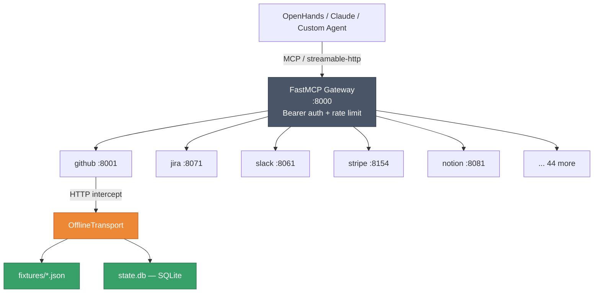
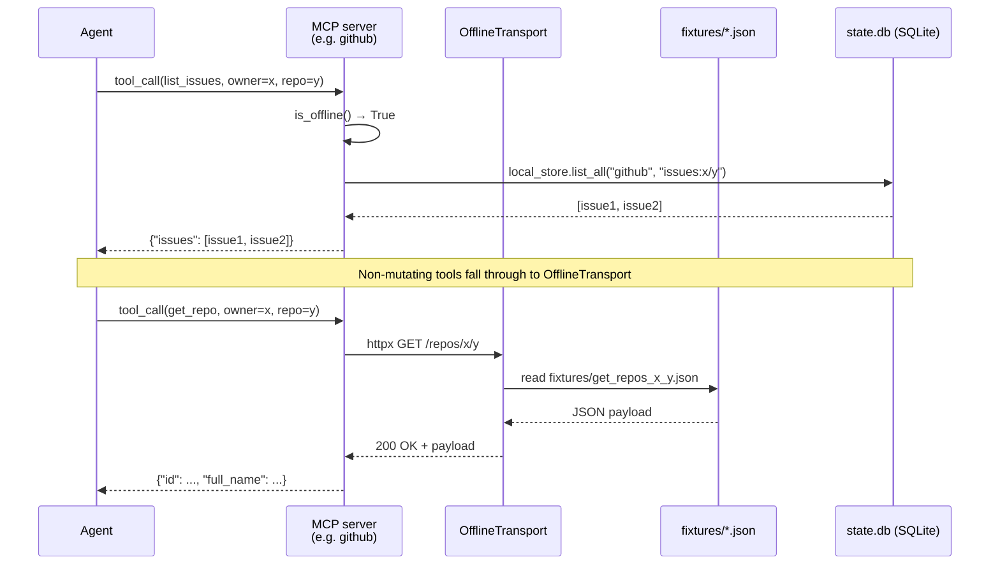
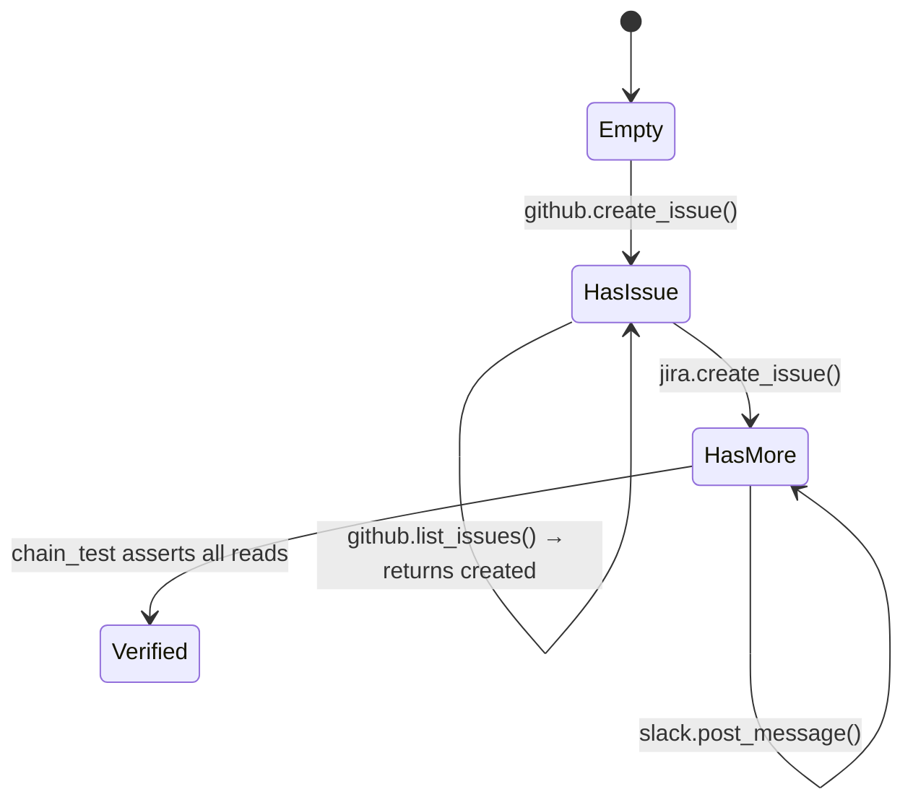
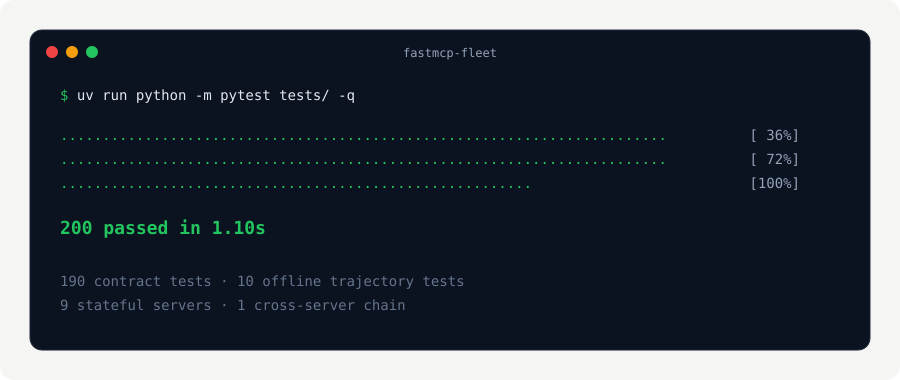
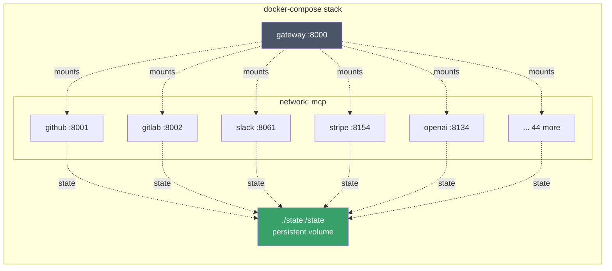

# fastmcp-fleet

[](LICENSE)
[](https://www.python.org/downloads/)
[](tests/)
[](docs/architecture.md)
[](registry/servers/)
[](https://github.com/jlowin/fastmcp)
[](deployment/compose/docker-compose.yml)
[](CONTRIBUTING.md)

> **A local-first FastMCP platform of 160+ mock MCP servers — GitHub, Slack, Stripe, Jira, Notion, Cloudflare, Datadog, and more — running behind one central gateway. Zero live API calls. Deterministic. Perfect for agent trajectory testing and OpenHands integration.**

<p align="center">
  
</p>

---

## Table of contents

- [What is fastmcp-fleet?](#what-is-fastmcp-fleet)
- [Why offline-first?](#why-offline-first)
- [Architecture](#architecture)
- [Quickstart](#quickstart)
- [Server catalogue](#server-catalogue)
- [How offline mode works](#how-offline-mode-works)
- [Local Store — stateful mocks](#local-store--stateful-mocks)
- [Add a new server in 5 minutes](#add-a-new-server-in-5-minutes)
- [Testing](#testing)
- [Docker deployment](#docker-deployment)
- [Contributing](#contributing)
- [License](#license)

---

## What is fastmcp-fleet?

fastmcp-fleet is a **catalogue of 173 planned MCP servers, 49 of them already implemented**, packaged behind one FastMCP gateway on port `:8000`. Every server can run **fully offline** — HTTP requests are intercepted by a custom transport that serves fixture JSON, and stateful tools persist to a per-server SQLite store so subsequent reads see prior writes.

The point is not to replace live SaaS APIs. It is to give AI agents (OpenHands, Claude, Cursor, custom stacks) a **realistic, deterministic, credential-free** environment for:

- MCP tool discovery testing
- Agent trajectory generation and validation
- Multi-step workflow rehearsal (create issue → update task → post message)
- CI/CD integration testing without hitting external quotas
- Local development and demonstration

## Why offline-first?

| Real APIs | fastmcp-fleet |
|---|---|
| Requires credentials for 40+ SaaS accounts | **No credentials required** |
| Rate-limited by external providers | **No rate limits** |
| Costs money (OpenAI, Anthropic, Stripe, ...) | **Free** |
| Non-deterministic (state changes between test runs) | **Deterministic** (fixture + SQLite) |
| Slow (network latency) | **Fast** (µs response times) |
| Needs internet | **Runs in an air-gapped container** |

Set `MCP_OFFLINE=1` (already the default in `docker-compose.yml`) and every server becomes a convincing local simulation.

---

## Architecture



Each MCP server runs in its own container on its own port (`8001`–`8173`). The gateway aggregates all of them so an agent connects **once** and gets the full fleet.

---

## Quickstart

### Local (Python + uv)

```bash
git clone https://github.com/deepakdalal1221/fastmcp-fleet.git
cd fastmcp-fleet
uv sync --extra all --extra dev
uv run python -m pytest tests/ -q
# 200 passed in ~1s
```

Run one server directly:

```bash
export MCP_OFFLINE=1
uv run python -m servers.github.server --port 8001
```

Then point Claude Desktop or any MCP client at `http://localhost:8001/mcp`.

### Docker (all 55 services + gateway)

```bash
cd deployment/compose
docker compose up -d --build
# Gateway available at http://localhost:8000
```

The compose stack ships with `MCP_OFFLINE: "1"` set on every service via the `x-common-env` anchor, and a `./state:/state` volume so SQLite state persists across restarts.

---

## Server catalogue

**61 servers active** across 13 categories. Full list of 173 catalogued in [`registry/servers/`](registry/servers/).

| Category | Count | Servers |
|---|---:|---|
| **AI / ML** | 5 | `anthropic`, `gemini`, `huggingface`, `mistral`, `openai` |
| **Business** | 3 | `hubspot`, `mailchimp`, `stripe` |
| **Cloud** | 6 | `cloudflare`, `digitalocean`, `fly-io`, `netlify`, `render`, `vercel` |
| **Communication** | 4 | `discord`, `sendgrid`, `slack`, `twilio` |
| **Database** | 5 | `elasticsearch`, `mongodb`, `mysql`, `redis`, `sqlite` |
| **Development** | 2 | `gitea`, `gitlab` |
| **DevOps** | 4 | `circleci`, `gitlab-ci`, `jenkins`, `terraform` |
| **Monitoring** | 6 | `datadog`, `grafana`, `new-relic`, `pagerduty`, `prometheus`, `sentry` |
| **Productivity** | 3 | `airtable`, `confluence`, `notion` |
| **Project Management** | 3 | `asana`, `jira`, `linear` |
| **Search** | 2 | `brave-search`, `tavily` |
| **Security** | 5 | `1password`, `auth0`, `okta`, `snyk`, `vault` |
| **Storage** | 1 | `s3` |

Plus foundational: `fetch`, `filesystem`, `time`, `github`, `postgres`.

---

## How offline mode works



Layered lookup: **specific fixture → `default.json` → synthetic `{"offline": true, ...}`**. Add per-endpoint JSON files at `servers/<id>/fixtures/<method>_<path-slug>.json` to customize responses.

---

## Local Store — stateful mocks

Nine servers wire mutation tools to a **SQLite-backed writable state** so agent workflows produce consistent results:



Stateful servers today:

| Server | Write tool | Read tool | State key |
|---|---|---|---|
| github | `create_issue` | `list_issues` | `issues:<owner>/<repo>` |
| jira | `create_issue` | `search_issues` (JQL) | `issues:<project_key>` |
| asana | `create_task` | `list_tasks` | `tasks:<project_id>` |
| linear | `create_issue` | `list_issues` | `issues:<team_id>` |
| slack | `post_message` | `get_conversation` | `messages:<channel>` |
| stripe | `create_payment_intent` | `list_charges` | `charges` |
| twilio | `send_sms` | `list_messages` | `messages:<to>` |
| pagerduty | `create_incident` | `list_incidents` | `incidents:<service_id>` |
| notion | `create_page` | `search` | `pages:<parent_id>` |

State survives `docker compose down/up` via the `./state:/state` volume mount.

---

## Add a new server in 5 minutes

```bash
# 1. Add an Entry to CATALOGUE (append at end — port assignment is index-based)
#    Edit scripts/build_registry.py

# 2. Regenerate manifests
uv run python scripts/build_registry.py

# 3. Scaffold the server
uv run mcp-create <your-server-id>

# 4. Implement servers/<your-server-id>/tools.py following the pattern in
#    servers/github/tools.py or servers/cloudflare/tools.py

# 5. Promote status: planned → active in registry/servers/<id>.yaml
```

See [CONTRIBUTING.md](CONTRIBUTING.md) for the full recipe (auth patterns, error mapping, response slimming, Local Store wiring).

---

## Testing

```bash
uv run python -m pytest tests/ -q
```

```
........................................................................ [ 36%]
........................................................................ [ 72%]
........................................................                 [100%]
200 passed in 1.10s
```

Breakdown:
- **190 contract tests** validate every manifest (schema, unique ports, valid auth types) and every server file (importable, `register_tools` exists, tools registered)
- **10 offline trajectory tests** exercise create → read chains across the 9 stateful servers, plus one cross-server chain (`github issue → jira issue → slack message`)

<p align="center">
  
</p>

---

## Docker deployment

55 services total (gateway + 54 servers). Each server:

- Built from `docker/Dockerfile.server` with `SERVER_ID` build-arg
- Exposes its port (`8001`–`8173`)
- Inherits `MCP_OFFLINE: "1"` and `MCP_STATE_DIR: /state` from `x-common-env`
- Mounts `./state:/state` for persistence (47 of them; gateway and filesystem opt out correctly)
- Registered in the gateway via `GATEWAY_SERVERS` env



---

## Contributing

Contributions welcome! See [CONTRIBUTING.md](CONTRIBUTING.md).

- **125 servers still planned** — pick one from `registry/servers/` where `status: planned` and implement its `tools.py`
- **More stateful mocks** — wire `create_*` tools to `local_store` for cross-tool consistency
- **Per-tool fixtures** — most servers only have `default.json`; add specific `<method>_<path-slug>.json` files for realism

## Community

- [Discussions](https://github.com/deepakdalal1221/fastmcp-fleet/discussions)
- [Issues](https://github.com/deepakdalal1221/fastmcp-fleet/issues)
- [Security policy](SECURITY.md)

## License

[MIT](LICENSE) © 2026 deepakdalal1221

---

<p align="center">
  Built with <a href="https://github.com/jlowin/fastmcp">FastMCP</a>, <a href="https://docs.astral.sh/uv/">uv</a>, and <a href="https://www.python.org/">Python 3.12+</a>.
</p>
